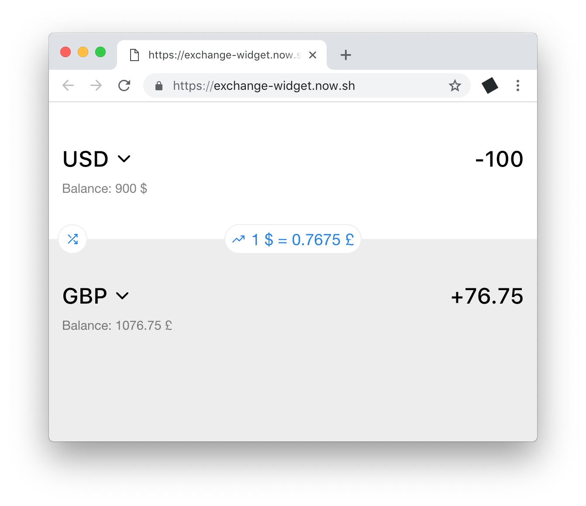

# Exchange Widget

> Small exchange app that gets actual rates from https://ratesapi.io



## Requirements

- [Node.js](https://nodejs.org/en/) >= 8.11
- [Yarn](https://yarnpkg.com/en/docs/install) package manager


## Quick Start

```sh
$ yarn
$ yarn run dev
$ open http://0.0.0.0:3000
```

## Build

```sh
$ yarn run build
$ yarn start
$ open http://0.0.0.0:3000
```


## Configuration

### Server environment variables

| name            | default                  | description 
|:----------------|:-------------------------|:---------------------------------
| `NODE_ENV`      | —                        | Used switching between `production`, `development` and `test` mode
| `NODE_DEBUG`    | —                        | Debug logs <br> (to show all  app logs set `NODE_DEBUG=exchange-widget:*`)
| `HOST`          | `0.0.0.0`                | Server host
| `PORT`          | `3000`                   | Server port
| `SITE_URL`      | `http://${HOST}:${PORT}` | Site public url <br> (used for api and socket in server and client)
| `RATES_API_URL` | `https://ratesapi.io`    | Url to exchange rates api provider

### Logs in browser

Set `window.localStorage.debug = 'exchange-widget:*'` in browser console.

- `exchange-widget:store` - redux store actions
- `exchange-widget:component:exchange-view` - `ExchangeView` component logs

More info in [`logdown.js`](https://github.com/caiogondim/logdown.js) docs.

---

MIT © [John Grishin](http://johngrish.in)
